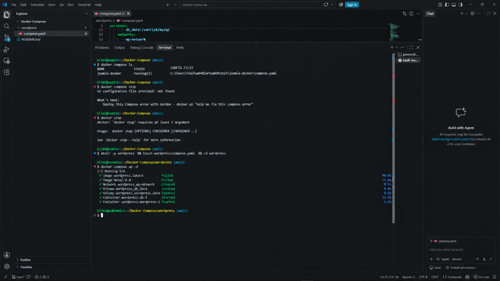
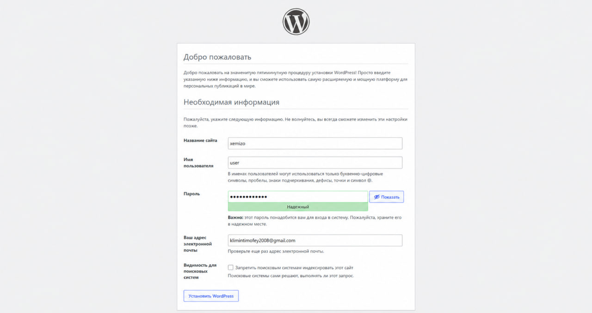

# WordPress в Docker Compose

Развёртывание WordPress с базой данных MySQL 8.0 в изолированной Docker-сети.

## 🗂️ Содержимое папки

```
.
├── compose.yaml                     # Конфигурация Docker Compose
├── photo_2026-09-15_12-25-52.jpg    # Установка WordPress
├── photo_2026-09-15_12-26-02.jpg    # Запуск docker compose up
├── photo_2026-09-15_12-26-06.jpg    # Админ-панель WordPress
└── README.md                        # 👈 Вы здесь
```

## 📋 Шаг 1: Проверка текущих контейнеров

```bash
docker compose ls
```

Если есть работающие проекты, которые могут конфликтовать, остановите их:

```bash
docker compose stop
```

## 📝 Шаг 2: Файл `compose.yaml`

```yaml
services:
  db:
    image: mysql:8.0
    restart: unless-stopped
    environment:
      MYSQL_ROOT_PASSWORD: somewordpress
      MYSQL_DATABASE: wordpress
      MYSQL_USER: wordpress
      MYSQL_PASSWORD: wordpress
    volumes:
      - db_data:/var/lib/mysql
    networks:
      - wp-network

  wordpress:
    depends_on:
      - db
    image: wordpress:latest
    ports:
      - "8081:80"
    restart: unless-stopped
    environment:
      WORDPRESS_DB_HOST: db:3306
      WORDPRESS_DB_USER: wordpress
      WORDPRESS_DB_PASSWORD: wordpress
      WORDPRESS_DB_NAME: wordpress
    volumes:
      - wordpress_data:/var/www/html
    networks:
      - wp-network

networks:
  wp-network:

volumes:
  db_data:
  wordpress_data:
```

## 🚀 Шаг 3: Запуск проекта

Из папки `grrrmonday`:

```bash
docker compose up -d
```

Дождитесь загрузки образов — это может занять несколько минут.



## ✅ Шаг 4: Проверка статуса

```bash
docker compose ps -a
```

Оба контейнера (`db` и `wordpress`) должны иметь статус **Up**.

## 🌐 Шаг 5: Открытие WordPress

Перейдите в браузере по адресу:

👉 **http://localhost:8081**

Пройдите стандартную установку WordPress:

1. Выберите язык
2. Введите название сайта и данные администратора
3. Войдите в админ-панель




## 🛠️ Полезные команды

```bash
docker compose stop      # Остановить контейнеры
docker compose start     # Запустить остановленные
docker compose restart   # Перезапустить
docker compose logs -f   # Логи в реальном времени

# Логи отдельного сервиса
docker compose logs -f wordpress
docker compose logs -f db
```

## 🗑️ Удаление проекта

```bash
# Остановить и удалить контейнеры (данные в томах сохранятся)
docker compose down

# Полное удаление вместе с данными (осторожно!)
docker compose down -v
```

## 📌 Примечания

- WordPress доступен на порту **8081**
- Данные хранятся в именованных томах `db_data` и `wordpress_data`
- ⚠️ Пароли в `compose.yaml` указаны для локальной разработки — **для продакшена обязательно смените их**

## 📄 Лицензия

MIT
